# ShieldKit — Architecture Diagrams

---

## System Architecture

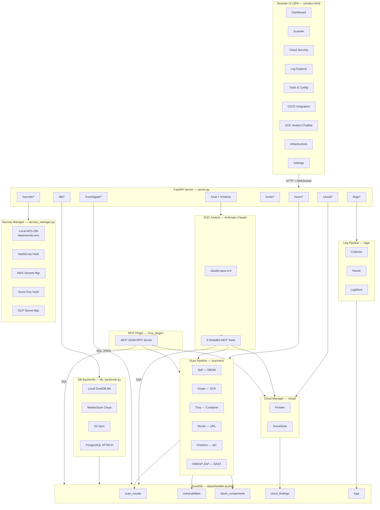

---

## Scan Lifecycle

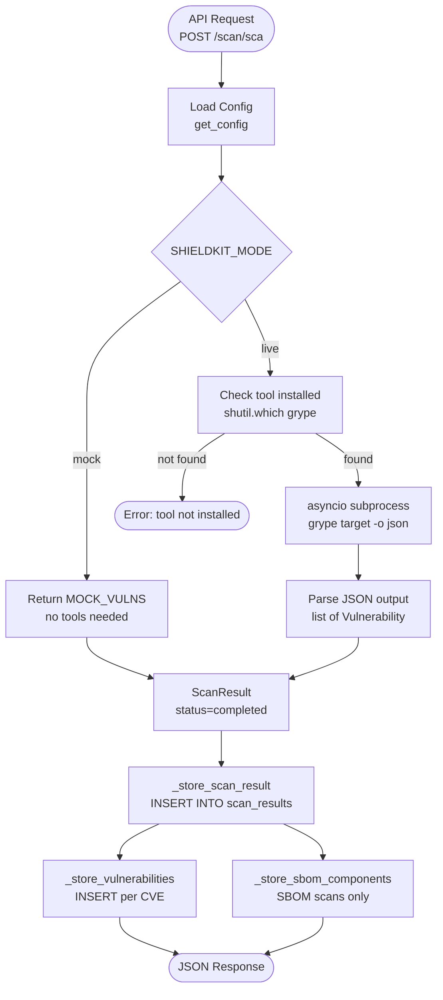

---

## SOC Analyst Chatbot — Agentic Loop

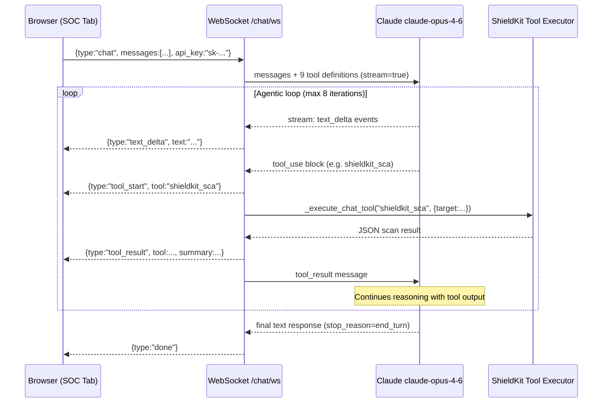

---

## Log Ingestion Pipeline

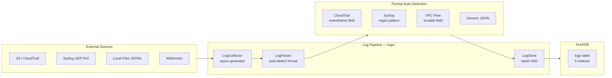

---

## DuckDB Correlation Model

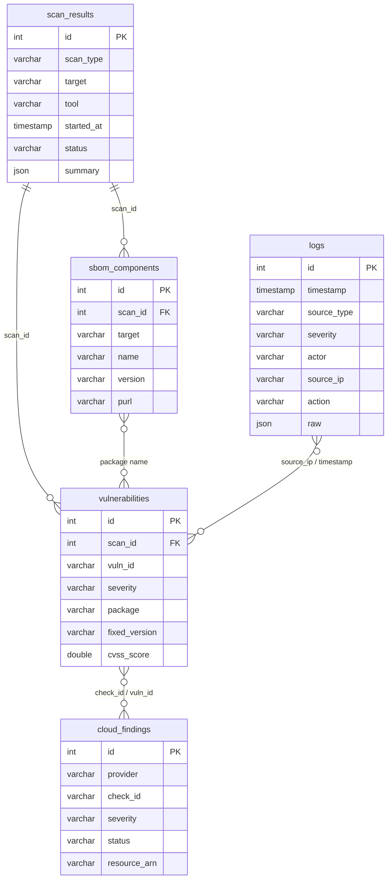

---

## Tool Install & Configuration Flow

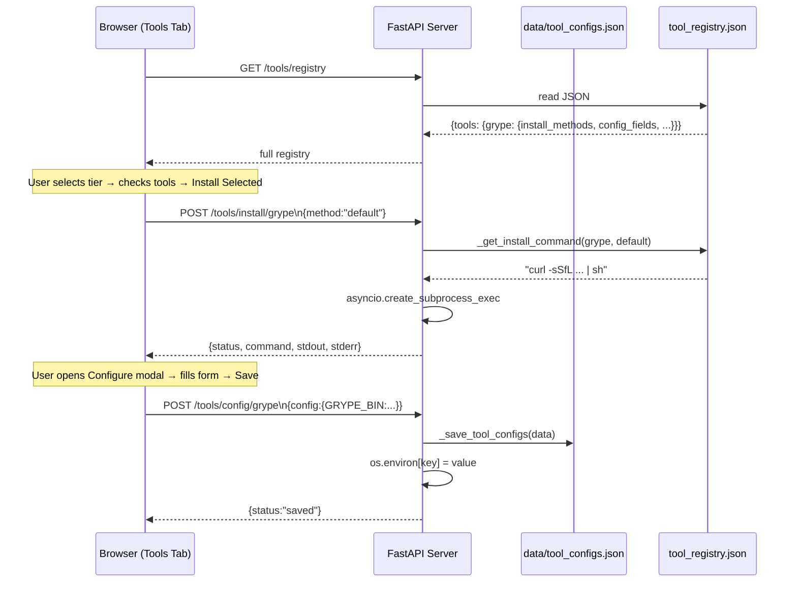

---

## Policy Builder Workflow

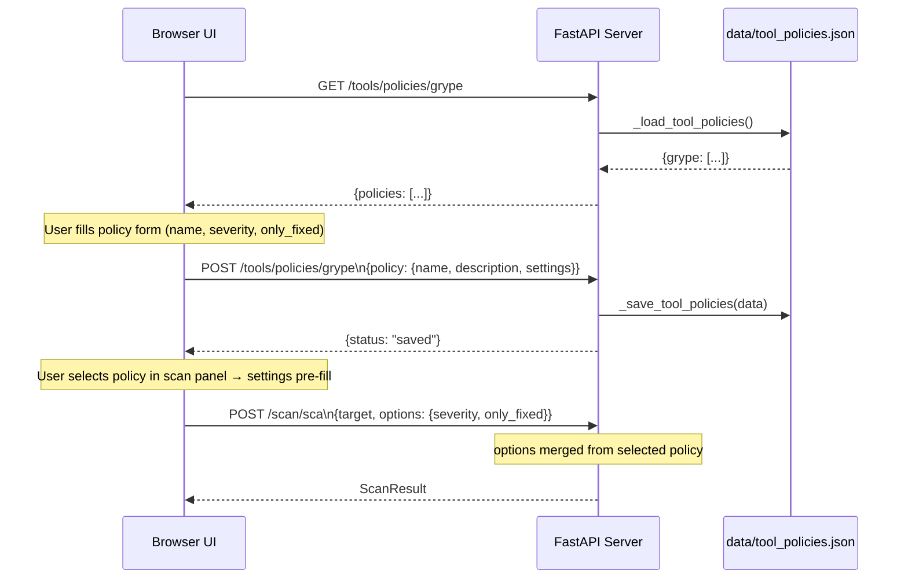

---

## CI/CD Integration — Config Generation

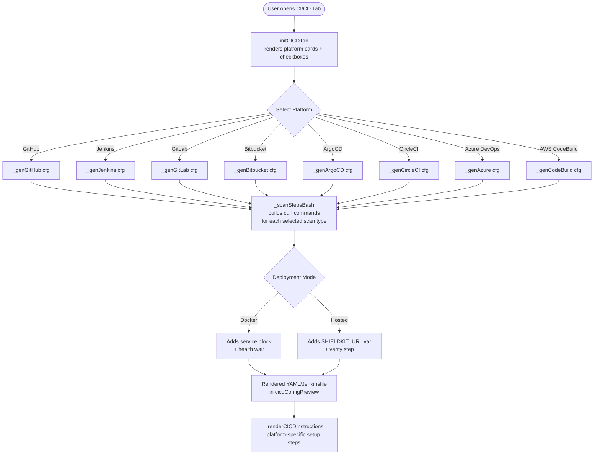

---

## MCP Plugin — External SOCPilot Integration

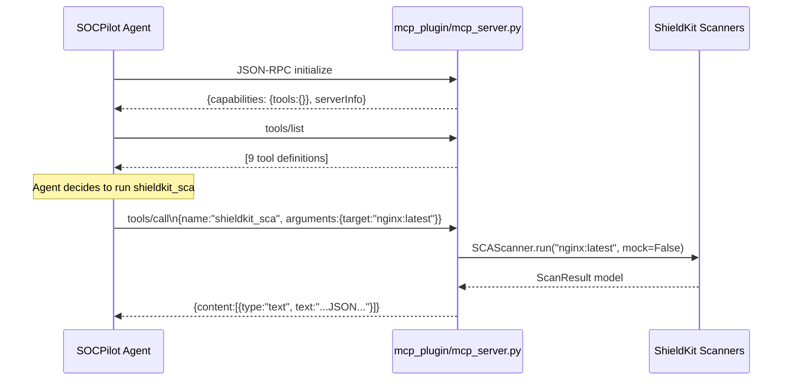

---

## Secrets Manager — Provider Selection & sk:// Reference Resolution

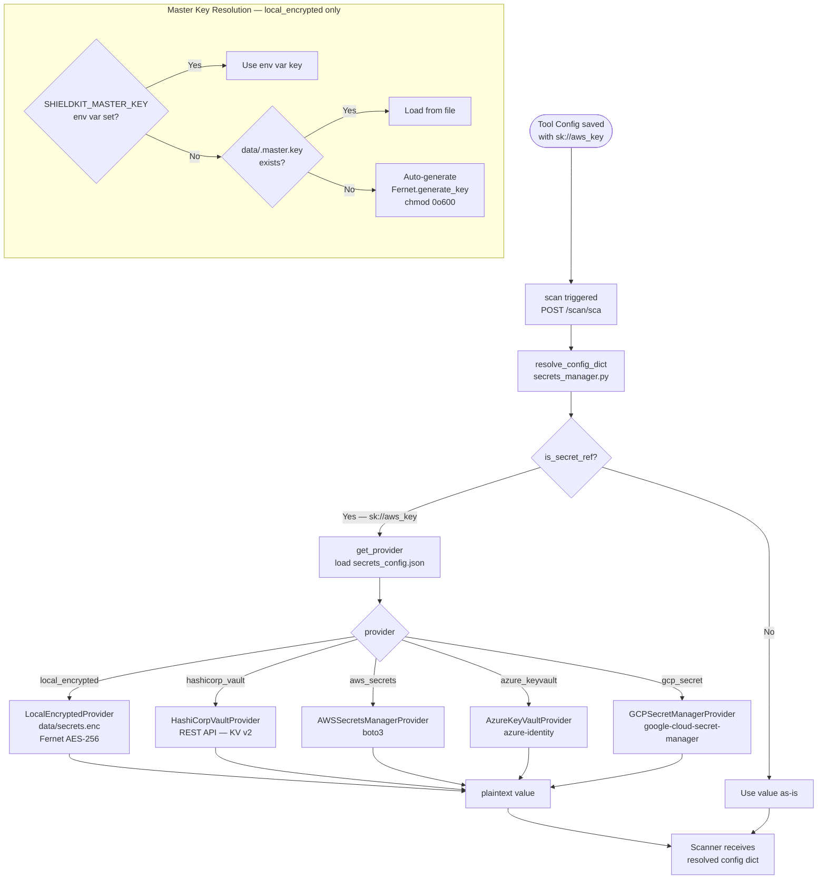

---

## Database Backend — Startup Selection

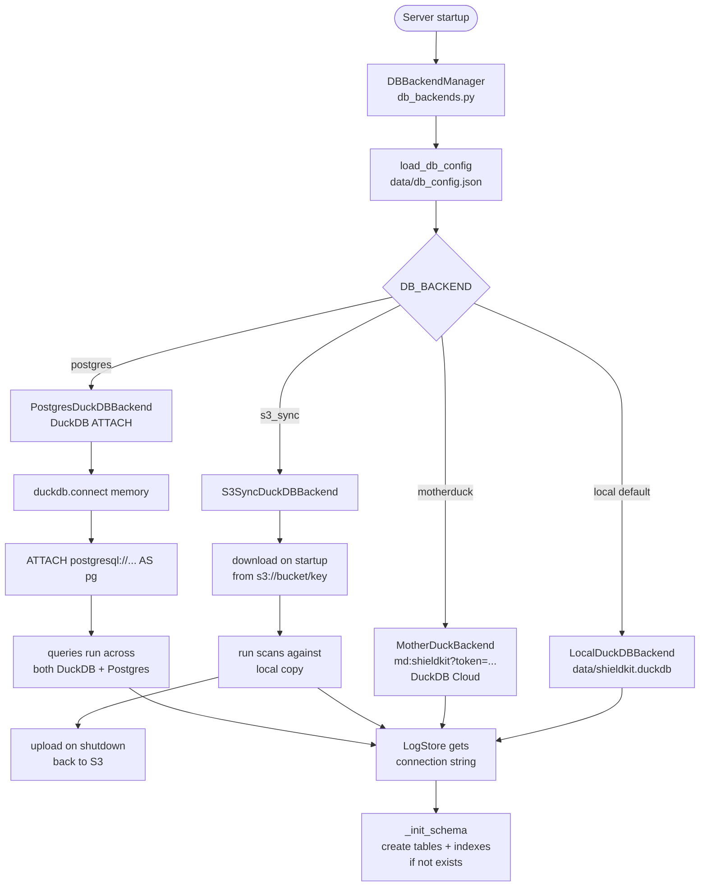

---

## Infrastructure Tab — Secrets + DB Config Flow

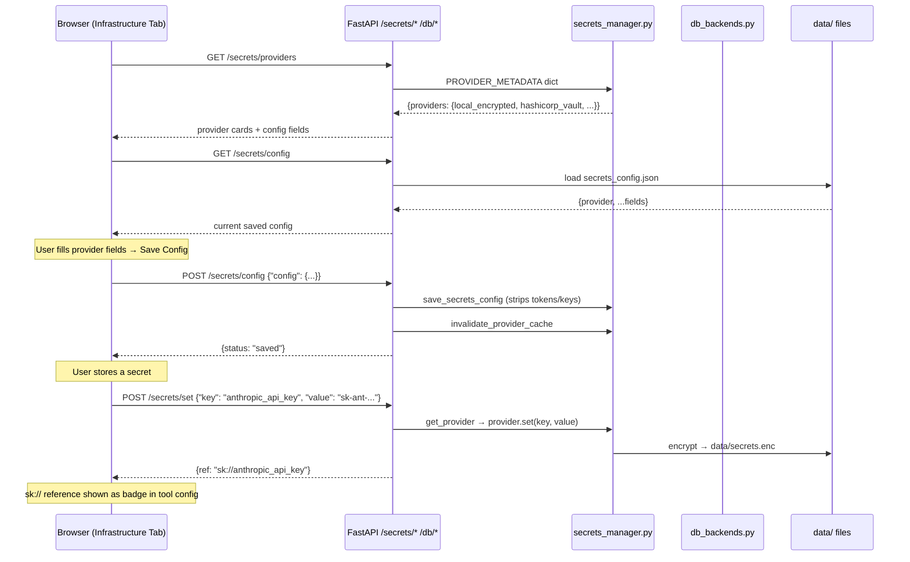
