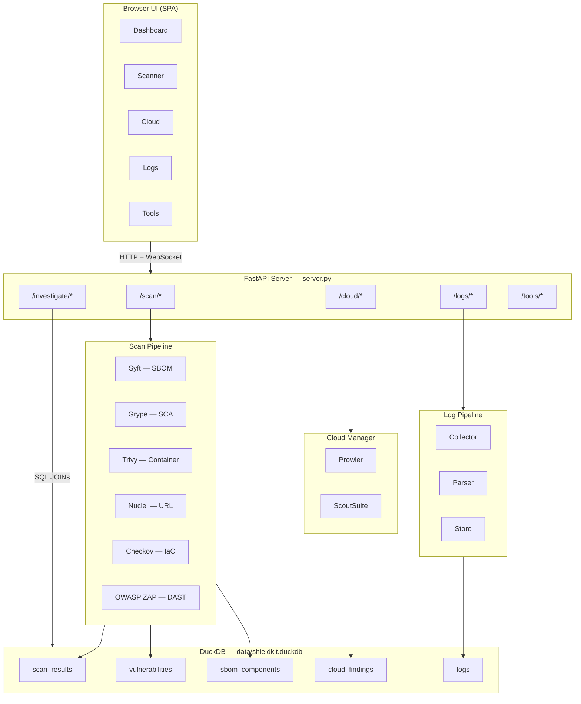
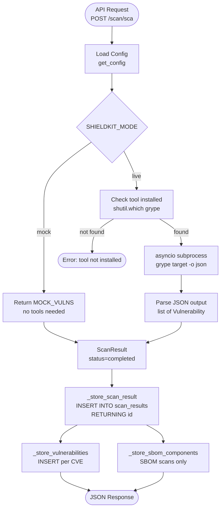
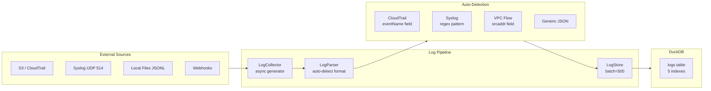
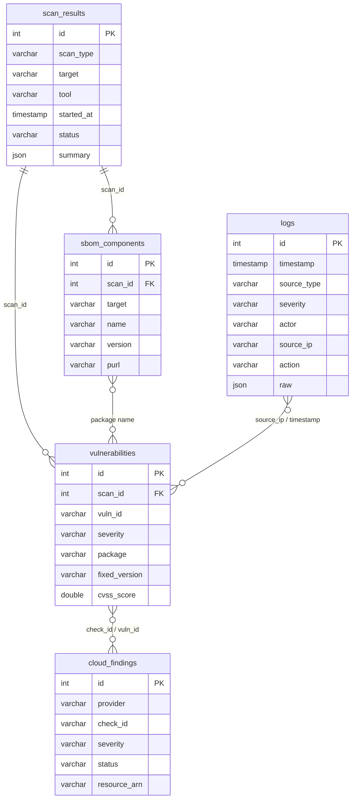
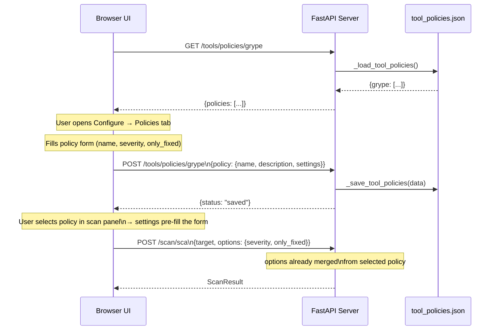

# ShieldKit — Security Scanning, Cloud Posture & Log Analytics Suite

ShieldKit is an open-source security toolkit that bundles SBOM generation, vulnerability scanning, cloud security posture management, DAST, and log analytics into a single platform. It runs standalone with a browser UI, HTTP API, and CLI — or connects to [SOCPilot](https://github.com/Parthasarathi7722/mcp-security-ops-suit) as an MCP server for AI-powered investigations.

---

## Architecture



---

## Scan Lifecycle



---

## Log Ingestion Pipeline



---

## DuckDB Correlation Model



---

## Policy Builder Workflow



---

## What's Inside

| Category           | Tool       | What It Does                                              |
|--------------------|------------|-----------------------------------------------------------|
| SBOM Generation    | Syft       | Software Bill of Materials — CycloneDX/SPDX               |
| SCA                | Grype      | Vulnerability scanning against dependency databases       |
| Container Scanning | Trivy      | OS + app vulnerabilities in container images              |
| URL Scanning       | Nuclei     | Endpoint vuln detection — template categories, severity  |
| DAST               | OWASP ZAP  | Dynamic app security testing — baseline/full/api modes    |
| Cloud Security     | Prowler    | AWS/Azure/GCP posture against CIS, SOC2, PCI-DSS          |
| Cloud Auditing     | ScoutSuite | Multi-cloud security assessment with HTML reports         |
| IaC Scanning       | Checkov    | Terraform, CloudFormation, K8s, Dockerfile checks         |
| Log Analytics      | DuckDB     | Embedded SQL analytics for CloudTrail, syslog, VPC flows  |

---

## Quick Start

### Option A — Mock Mode (zero tools required)

```bash
git clone https://github.com/Parthasarathi7722/shieldkit.git
cd shieldkit
python3 -m venv .venv && source .venv/bin/activate
pip install -r requirements.txt

# Start the server (from inside the project directory)
python run.py
```

Open **http://localhost:8000** in your browser.

Mock mode returns realistic sample data for every scan type — no tools needed.

> **Alternative start command** (must be run from the **parent** directory, since `shieldkit` is a Python package):
> ```bash
> cd ..   # go up one level from shieldkit/
> SHIELDKIT_MODE=mock uvicorn shieldkit.server:app --host 0.0.0.0 --port 8000
> ```

### Option B — With Tools (live mode)

```bash
python onboard.py          # interactive setup wizard — creates .env
python run.py              # reads .env automatically
```

### Option C — Docker

```bash
python onboard.py          # generates .env
docker compose up -d
curl http://localhost:8000/health
```

### Verify it's running

```bash
curl http://localhost:8000/health
# {"status":"ok","mode":"mock","version":"1.0.0"}

# Quick smoke test — run an SCA scan in mock mode
curl -s -X POST http://localhost:8000/scan/sca \
  -H "Content-Type: application/json" \
  -d '{"target":"nginx:latest"}'
```

---

## Step-by-Step Configuration

### 1. Environment Variables

Create a `.env` file in the project root (or run `python onboard.py` to generate one):

```bash
# ── Mode ──────────────────────────────────────────────────
SHIELDKIT_MODE=mock          # mock | live

# ── Server ────────────────────────────────────────────────
SERVER_HOST=0.0.0.0
SERVER_PORT=8000

# ── Database ──────────────────────────────────────────────
DUCKDB_PATH=data/shieldkit.duckdb
LOG_RETENTION_DAYS=90

# ── Tool Paths (auto-detected from PATH if omitted) ───────
SYFT_BIN=syft
GRYPE_BIN=grype
TRIVY_BIN=trivy
NUCLEI_BIN=nuclei
CHECKOV_BIN=checkov
PROWLER_BIN=prowler
SCOUTSUITE_BIN=scout

# ── OWASP ZAP ─────────────────────────────────────────────
ZAP_USE_DOCKER=true                              # true = Docker image, false = native daemon
ZAP_DOCKER_IMAGE=ghcr.io/zaproxy/zaproxy:stable
ZAP_HOST=localhost                               # used only when ZAP_USE_DOCKER=false
ZAP_PORT=8080
ZAP_API_KEY=

# ── AWS ───────────────────────────────────────────────────
AWS_PROFILE=default
AWS_REGION=us-east-1

# ── Azure ─────────────────────────────────────────────────
AZURE_SUBSCRIPTION_ID=
AZURE_TENANT_ID=

# ── GCP ───────────────────────────────────────────────────
GCP_PROJECT_ID=

# ── AI / MCP plugin ───────────────────────────────────────
AI_API_KEY=
AI_PROVIDER=anthropic
AI_MODEL=claude-sonnet-4-20250514
```

### 2. Tool Installation

**Recommended: via the browser UI**
1. Open `http://localhost:8000` → Tools tab
2. Select a tier preset (Starter / Full Scanner / Cloud / DAST)
3. Click **Install Selected** → choose install method per tool → confirm

**Or via the onboarding CLI:**
```bash
python onboard.py --tier starter   # Syft + Grype + Trivy
python onboard.py --tier full      # + Nuclei + Checkov
python onboard.py --tier cloud     # + Prowler + ScoutSuite
python onboard.py --add zap        # Add OWASP ZAP only
python onboard.py --check          # Verify all installations
```

**Or manually:**
```bash
# macOS
brew install anchore/grype/grype anchore/syft/syft aquasecurity/trivy/trivy
pip install checkov prowler nuclei

# Linux
curl -sSfL https://raw.githubusercontent.com/anchore/grype/main/install.sh | sh
curl -sSfL https://raw.githubusercontent.com/anchore/syft/main/install.sh | sh
wget https://github.com/aquasecurity/trivy/releases/latest/download/trivy_Linux_64bit.tar.gz

# OWASP ZAP (Docker — recommended)
docker pull ghcr.io/zaproxy/zaproxy:stable
```

### 3. Configure Individual Tools

After installing, configure credentials via the UI (Tools tab → Configure) or API:

```bash
# Save Grype config
curl -X POST http://localhost:8000/tools/config/grype \
  -H "Content-Type: application/json" \
  -d '{"config": {"GRYPE_DB_UPDATE_ON_START": "true"}}'

# Save Prowler cloud credentials
curl -X POST http://localhost:8000/tools/config/prowler \
  -H "Content-Type: application/json" \
  -d '{"config": {"AWS_PROFILE": "prod", "AWS_REGION": "us-east-1"}}'

# Save ZAP settings
curl -X POST http://localhost:8000/tools/config/zap \
  -H "Content-Type: application/json" \
  -d '{"config": {"ZAP_USE_DOCKER": "true", "ZAP_API_KEY": "changeme"}}'

# Read saved config for any tool
curl http://localhost:8000/tools/config/trivy
```

Configs persist to `data/tool_configs.json` and are applied to the environment for the running session.

### 4. Scan Policies (Optional)

Named, reusable scan configurations per tool. Create via the UI (Tools tab → Configure → Policies tab) or API:

```bash
# Create a "Strict Production" policy for Grype
curl -X POST http://localhost:8000/tools/policies/grype \
  -H "Content-Type: application/json" \
  -d '{
    "policy": {
      "name": "Strict Production",
      "description": "Block critical and high, only fixed CVEs",
      "settings": {"severity": "critical,high", "only_fixed": "true"}
    }
  }'

# Create a Checkov policy for Terraform-only
curl -X POST http://localhost:8000/tools/policies/checkov \
  -H "Content-Type: application/json" \
  -d '{
    "policy": {
      "name": "Terraform CIS",
      "settings": {"framework": "terraform", "soft_fail": "false"}
    }
  }'

# List policies for a tool
curl http://localhost:8000/tools/policies/grype

# Delete a policy
curl -X DELETE http://localhost:8000/tools/policies/grype/Strict%20Production
```

---

## Running Scans

### Browser UI

Scanner tab → select scan type → enter target → (optionally pick a policy) → **Run Scan**

Each scan type has a dedicated options panel:
- **SBOM / SCA / Container / IaC** — policy picker + format/severity options
- **URL (Nuclei)** — template categories, severity checkboxes, rate limit, concurrency, custom template path
- **DAST (ZAP)** — scan mode (baseline/full/api), auth method, attack strength, alert threshold

### HTTP API

```bash
# SBOM
curl -X POST http://localhost:8000/scan/sbom -d '{"target":"nginx:latest"}'

# SCA — vulnerability scan
curl -X POST http://localhost:8000/scan/sca -d '{"target":"nginx:latest"}'

# Container image
curl -X POST http://localhost:8000/scan/container -d '{"target":"myapp:v1.2.3"}'

# URL / Nuclei — with template options
curl -X POST http://localhost:8000/scan/url \
  -H "Content-Type: application/json" \
  -d '{
    "target": "https://example.com",
    "options": {
      "categories": ["cves","misconfigs","exposures"],
      "severity": ["critical","high"],
      "rate_limit": 100,
      "concurrency": 20
    }
  }'

# IaC — Terraform directory
curl -X POST http://localhost:8000/scan/iac \
  -d '{"target":"./terraform/", "options":{"framework":"terraform"}}'

# DAST — ZAP baseline (safe for production)
curl -X POST http://localhost:8000/scan/zap \
  -H "Content-Type: application/json" \
  -d '{"target":"https://example.com","scan_mode":"baseline","auth_method":"none"}'

# DAST — ZAP full active scan with form auth
curl -X POST http://localhost:8000/scan/zap \
  -H "Content-Type: application/json" \
  -d '{
    "target": "https://example.com",
    "scan_mode": "full",
    "auth_method": "form",
    "auth_config": {
      "login_url": "https://example.com/login",
      "username_field": "username",
      "password_field": "password",
      "username": "testuser",
      "password": "testpass"
    },
    "attack_strength": "high",
    "alert_threshold": "medium"
  }'

# Full parallel scan (SBOM + SCA + Container)
curl -X POST http://localhost:8000/scan/full -d '{"target":"nginx:latest"}'

# Cloud posture
curl -X POST http://localhost:8000/cloud/scan \
  -d '{"provider":"aws","tool":"prowler","compliance":["cis","soc2"]}'
```

---

## Log Analytics & Investigation

### Ingest Logs

```bash
# Mock data (no real sources needed)
curl -X POST http://localhost:8000/logs/ingest/mock

# CloudTrail from S3
curl -X POST http://localhost:8000/logs/ingest \
  -H "Content-Type: application/json" \
  -d '{"source_type":"cloudtrail","config":{"bucket":"my-trail-bucket","region":"us-east-1"}}'

# Local log file
curl -X POST http://localhost:8000/logs/ingest \
  -d '{"source_type":"file","config":{"path":"/var/log/app.json","format":"json"}}'

# Syslog listener (collects for 10s)
curl -X POST http://localhost:8000/logs/ingest \
  -d '{"source_type":"syslog","config":{"host":"0.0.0.0","port":514}}'
```

### Search & Query

```bash
# Structured search
curl -X POST http://localhost:8000/logs/query \
  -d '{"source_ip":"203.0.113.45","severity":"high","limit":50}'

# Raw SQL (full DuckDB dialect)
curl -X POST http://localhost:8000/logs/query \
  -H "Content-Type: application/json" \
  -d '{
    "sql": "SELECT source_type, COUNT(*) as n FROM logs GROUP BY source_type"
  }'

# Aggregate stats
curl http://localhost:8000/logs/stats
```

### Investigation & Correlation

```bash
# Unified timeline — logs + scans + cloud findings in one stream
curl "http://localhost:8000/investigate/timeline?hours=24"

# Full profile for an IP — first seen, actions, severity breakdown
curl http://localhost:8000/investigate/ip/203.0.113.45

# Package investigation — SBOM occurrences + CVEs + related logs
curl http://localhost:8000/investigate/package/express

# CVE investigation — all scans that found it + matching cloud findings
curl http://localhost:8000/investigate/vuln/CVE-2024-50623
```

The UI has these as one-click buttons in the **Logs tab → Investigate & Correlate** panel.

---

## DuckDB Schema

All data lives in `data/shieldkit.duckdb`. Every table is queryable via `/logs/query`.

```sql
-- logs: normalized security events from all sources
CREATE TABLE logs (
    id              INTEGER PRIMARY KEY,
    timestamp       TIMESTAMP NOT NULL,
    source          VARCHAR,      -- cloudtrail | syslog | vpc-flow | ...
    source_type     VARCHAR,
    severity        VARCHAR,      -- critical | high | medium | low | info
    event_type      VARCHAR,      -- authentication | modification | network | ...
    actor           VARCHAR,      -- IAM user, role, hostname
    action          VARCHAR,      -- ConsoleLogin, PutObject, ssh, ...
    target_resource VARCHAR,
    source_ip       VARCHAR,
    region          VARCHAR,
    account_id      VARCHAR,
    raw             JSON,
    tags            VARCHAR[],
    ingested_at     TIMESTAMP
);

-- scan_results: one row per scan run
CREATE TABLE scan_results (
    id           INTEGER PRIMARY KEY,
    scan_type    VARCHAR,   -- sbom | sca | container | url | iac | dast
    target       VARCHAR,
    tool         VARCHAR,
    started_at   TIMESTAMP,
    completed_at TIMESTAMP,
    status       VARCHAR,   -- running | completed | failed
    summary      JSON       -- {"critical":2, "high":5, ...}
);

-- vulnerabilities: individual CVEs, linked to scan_results via scan_id
CREATE TABLE vulnerabilities (
    id                INTEGER PRIMARY KEY,
    scan_id           INTEGER,   -- FK → scan_results.id
    vuln_id           VARCHAR,   -- CVE-2024-XXXXX or check ID
    severity          VARCHAR,
    package           VARCHAR,
    installed_version VARCHAR,
    fixed_version     VARCHAR,
    description       VARCHAR,
    cvss_score        DOUBLE,
    data_source       VARCHAR,
    discovered_at     TIMESTAMP
);

-- sbom_components: package inventory from Syft scans
CREATE TABLE sbom_components (
    id           INTEGER PRIMARY KEY,
    scan_id      INTEGER,   -- FK → scan_results.id
    target       VARCHAR,
    name         VARCHAR,
    version      VARCHAR,
    type         VARCHAR,
    purl         VARCHAR,
    licenses     VARCHAR[],
    discovered_at TIMESTAMP
);

-- cloud_findings: posture findings from Prowler / ScoutSuite
CREATE TABLE cloud_findings (
    id           INTEGER PRIMARY KEY,
    provider     VARCHAR,   -- aws | azure | gcp
    tool         VARCHAR,
    service      VARCHAR,   -- iam | s3 | ec2 | ...
    region       VARCHAR,
    resource_arn VARCHAR,
    check_id     VARCHAR,
    check_title  VARCHAR,
    severity     VARCHAR,
    status       VARCHAR,   -- PASS | FAIL | WARN
    description  VARCHAR,
    remediation  VARCHAR,
    compliance   VARCHAR[], -- cis | soc2 | pci-dss | ...
    discovered_at TIMESTAMP
);
```

**Useful correlation queries:**

```sql
-- Packages with critical CVEs deployed across multiple targets
SELECT v.package, v.vuln_id, v.severity, v.cvss_score,
       COUNT(DISTINCT sr.target) as affected_targets
FROM vulnerabilities v
JOIN scan_results sr ON v.scan_id = sr.id
WHERE v.severity = 'critical'
GROUP BY v.package, v.vuln_id, v.severity, v.cvss_score
ORDER BY affected_targets DESC, v.cvss_score DESC;

-- Suspicious IPs: failed auth in logs + active during a scan window
SELECT l.source_ip, l.actor, COUNT(*) as failed_auths,
       MIN(l.timestamp) as first_attempt
FROM logs l
WHERE l.event_type = 'authentication'
  AND l.severity IN ('medium','high','critical')
  AND l.timestamp > now() - INTERVAL '24 hours'
GROUP BY l.source_ip, l.actor
ORDER BY failed_auths DESC;

-- IaC checks that also appear as cloud posture failures
SELECT DISTINCT v.vuln_id as check_id, v.severity,
       cf.service, cf.resource_arn, cf.status
FROM vulnerabilities v
JOIN scan_results sr ON v.scan_id = sr.id
JOIN cloud_findings cf ON cf.check_id = v.vuln_id
WHERE sr.scan_type = 'iac'
ORDER BY v.severity;

-- Complete audit: what changed during an incident window
SELECT timestamp::VARCHAR as ts, 'log' as kind,
       actor, action, source_ip, target_resource as target
FROM logs
WHERE timestamp BETWEEN '2025-01-15 02:00' AND '2025-01-15 03:00'
UNION ALL
SELECT started_at::VARCHAR, 'scan', '', scan_type, '', target
FROM scan_results
WHERE started_at BETWEEN '2025-01-15 02:00' AND '2025-01-15 03:00'
ORDER BY ts;
```

---

## Browser UI Tabs

| Tab | What it does |
|---|---|
| **Dashboard** | Scan counts, severity breakdown, recent scan history, quick-action buttons |
| **Scanner** | Pick scan type → enter target → configure options/policy → run → live results |
| **Cloud Security** | Provider + compliance selector → run posture scan → findings table |
| **Logs** | Search/SQL query panel · Stats sidebar · Log results table · **Investigate & Correlate** panel |
| **Tools** | Install tools (tier presets / batch install) · Configure credentials · Manage scan policies |

---

## API Reference Summary

Full interactive docs at `http://localhost:8000/docs` (Swagger UI).

| Method | Path | Description |
|---|---|---|
| GET | `/health` | Server status and mode |
| POST | `/scan/sbom` | Generate SBOM (Syft) |
| POST | `/scan/sca` | Vulnerability scan (Grype) |
| POST | `/scan/container` | Container scan (Trivy) |
| POST | `/scan/url` | URL/endpoint scan (Nuclei) |
| POST | `/scan/iac` | IaC misconfiguration scan (Checkov) |
| POST | `/scan/zap` | DAST scan (OWASP ZAP) |
| POST | `/scan/full` | Parallel SBOM + SCA + Container |
| POST | `/cloud/scan` | Cloud posture scan |
| GET | `/cloud/providers` | Supported providers and tools |
| GET | `/cloud/compliance` | Available compliance frameworks |
| POST | `/logs/ingest` | Ingest logs from a source |
| POST | `/logs/ingest/mock` | Ingest sample log data |
| POST | `/logs/query` | SQL or structured log search |
| GET | `/logs/stats` | Aggregate log statistics |
| GET | `/history/scans` | Scan history from DuckDB |
| GET | `/history/vulnerabilities` | CVE history from DuckDB |
| GET | `/investigate/timeline` | Unified event timeline |
| GET | `/investigate/ip/{ip}` | IP activity profile |
| GET | `/investigate/package/{name}` | Package SBOM + CVE + log correlation |
| GET | `/investigate/vuln/{id}` | CVE cross-scan view |
| GET | `/tools/status` | Installation status of all tools |
| GET | `/tools/registry` | Full tool registry JSON |
| GET | `/tools/config` | All saved tool configurations |
| GET | `/tools/config/{tool}` | Single tool configuration |
| POST | `/tools/config/{tool}` | Save tool configuration |
| POST | `/tools/install/{tool}` | Run install command for a tool |
| GET | `/tools/policies/{tool}` | List scan policies for a tool |
| POST | `/tools/policies/{tool}` | Create or update a scan policy |
| DELETE | `/tools/policies/{tool}/{name}` | Delete a scan policy |

---

## Deployment Tiers

| Tier | Tools Included | Use Case |
|---|---|---|
| **Starter** | Syft, Grype, Trivy | Dev/CI — SBOM + CVE + container |
| **Full Scanner** | Starter + Nuclei, Checkov | + URL endpoint tests + IaC checks |
| **Cloud Security** | Full Scanner + Prowler, ScoutSuite | + AWS/Azure/GCP posture |
| **DAST** | Full Scanner + OWASP ZAP | + Dynamic app security testing |
| **Full** | Everything above | Complete coverage |
| **Custom** | Pick your tools | Targeted deployment |

---

## SOCPilot MCP Integration

ShieldKit exposes itself as an MCP server for [SOCPilot](https://github.com/Parthasarathi7722/mcp-security-ops-suit). Add to SOCPilot's `mcp_config.json`:

```json
{
  "mcpServers": {
    "shieldkit": {
      "command": "python",
      "args": ["-m", "shieldkit.mcp_plugin"],
      "env": { "SHIELDKIT_MODE": "live" }
    }
  }
}
```

This exposes 9 tools to the SOCPilot AI agent:

| MCP Tool | Maps To |
|---|---|
| `shieldkit_sbom` | `POST /scan/sbom` |
| `shieldkit_sca` | `POST /scan/sca` |
| `shieldkit_container_scan` | `POST /scan/container` |
| `shieldkit_url_scan` | `POST /scan/url` |
| `shieldkit_iac_scan` | `POST /scan/iac` |
| `shieldkit_cloud_scan` | `POST /cloud/scan` |
| `shieldkit_log_query` | `POST /logs/query` |
| `shieldkit_log_stats` | `GET /logs/stats` |
| `shieldkit_log_ingest` | `POST /logs/ingest` |

Example SOCPilot prompt:

> "Alert SEC-7721: suspicious activity on payments-api container.
> Run SBOM + SCA on the image, check cloud posture for the hosting account,
> and search logs for the source IP 203.0.113.45."

---

## Onboarding CLI

```bash
python onboard.py              # Full interactive wizard
python onboard.py --check      # Verify all tool installations
python onboard.py --list       # List available tools and status
python onboard.py --add trivy  # Add and configure a single tool
python onboard.py --tier cloud # Set up a deployment tier
```

---

## Project Structure

```
shieldkit/
├── server.py             # FastAPI app — all HTTP + WebSocket endpoints
├── config.py             # Centralised env-var config, lazy singleton
├── models.py             # Shared Pydantic models (ScanResult, Vulnerability, …)
├── onboard.py            # Interactive setup wizard
├── tool_registry.json    # Tool metadata, install commands, config fields
├── scanners/
│   ├── base.py           # BaseScanner + async _run_cmd + check_tool
│   ├── sbom.py           # SBOMScanner  → Syft
│   ├── sca.py            # SCAScanner   → Grype
│   ├── container.py      # ContainerScanner → Trivy
│   ├── url_scanner.py    # URLScanner   → Nuclei
│   ├── iac.py            # IaCScanner   → Checkov
│   └── zap_scanner.py    # ZAPScanner   → OWASP ZAP (Docker + daemon)
├── cloud/
│   ├── cloud_manager.py      # Routes to Prowler or ScoutSuite
│   ├── prowler_scanner.py    # Prowler multi-cloud assessment
│   └── scoutsuite_scanner.py # ScoutSuite auditing
├── logs/
│   ├── collector.py      # S3 / CloudTrail / file / syslog / webhook
│   ├── parser.py         # Auto-detect + normalize → NormalizedLog
│   ├── store.py          # DuckDB schema, insert, query, stats
│   └── pipeline.py       # Collect → parse → store orchestration
├── mcp_plugin/
│   ├── mcp_server.py     # MCP JSON-RPC server (9 tools)
│   └── __main__.py       # Entry point: python -m shieldkit.mcp_plugin
├── ui/
│   └── index.html        # Single-file SPA — all tabs, styles, JS
├── data/
│   ├── shieldkit.duckdb  # All persistent data (auto-created)
│   ├── tool_configs.json # Saved tool configuration (auto-created)
│   └── tool_policies.json # Saved scan policies (auto-created)
├── Dockerfile
├── docker-compose.yml
└── requirements.txt
```

---

## License

MIT

---

**Part of the Chaos to Control ecosystem:**
- [SOCPilot](https://github.com/Parthasarathi7722/mcp-security-ops-suit) — AI-powered SOC co-pilot
- [DevSecOps Pipeline](https://github.com/Parthasarathi7722/devsecops-pipeline) — CI/CD security gates
- [Cloud Security Checklists](https://github.com/Parthasarathi7722/cloud-security-checklists) — AWS hardening by service
